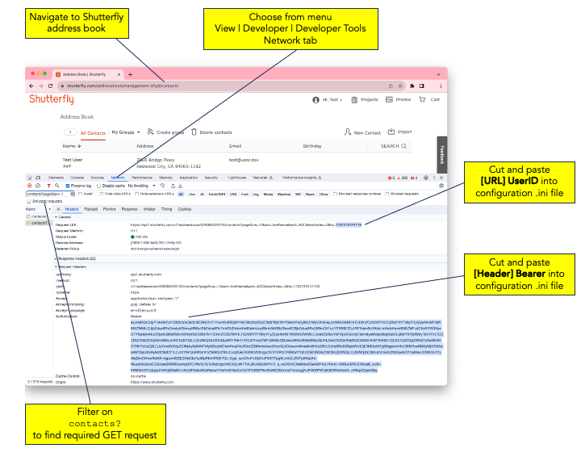

# sflyaddbook
Export a Shutterfly user's [address book](https://www.shutterfly.com/addressbook/management.sfly#/contacts).
## Purpose
The Shutterfly address book supports imports from .csv files, but not exports. How to overcome this limitation?

This Python3 program requests a user's full address book (contacts) and
loads it into a Pandas DataFrame. The configuration file allows manipulation
of which columns are output and in which sort order. The list is saved in
an output .csv file, for opening with Excel, Google Sheets, or other
compatible applications.
## Credentials and Configuration
The Shuttefly login procedure uses AWS Cognito credentials with
Google ReCAPTCHA to prevent robotic access, a process that is opaque and
challenging to replicate. Rather than attempt to gather
the required credentials programmatically, this program expects the user
to login manually via a web browser, then use Developer Tools to cut and 
paste the UserID and Bearer token into the configuration .ini file.


## Command Line Options
```
$ python3 sflyaddbook.py --help
usage: sflyaddbook.py [-h] [-c CONFIG_FILE] [-o OUTPUT_FILE]

Download Shutterfly address book and save as .csv file.

options:
  -h, --help            show this help message and exit
  -c CONFIG_FILE, --config CONFIG_FILE
                        default: sflyaddbook.ini
  -o OUTPUT_FILE, --output OUTPUT_FILE
                        default: shutterfly_address_book.csv

Instructions for Shutterfly credentials in example config .ini file.
```
## Testing and Compatibility
Developed and tested with Python 3.11.5.

Tested with multiple Shutterfly user accounts, up to about 200 addresses, mostly U.S. addresses with some international.

Performs as expected in December 2023. As with all reverse engineering, undocumented API changes and unexpected behavior may occur without notice.
## Feedback
Feedback welcome about instructions, bugs, or feature requests,
via the [Issues](https://github.com/llang629/sflyaddbook/issues) tab.

-
Copyright &copy;2023 Larry Lang
